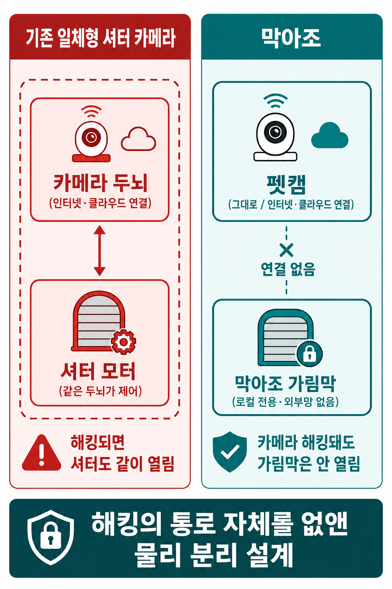
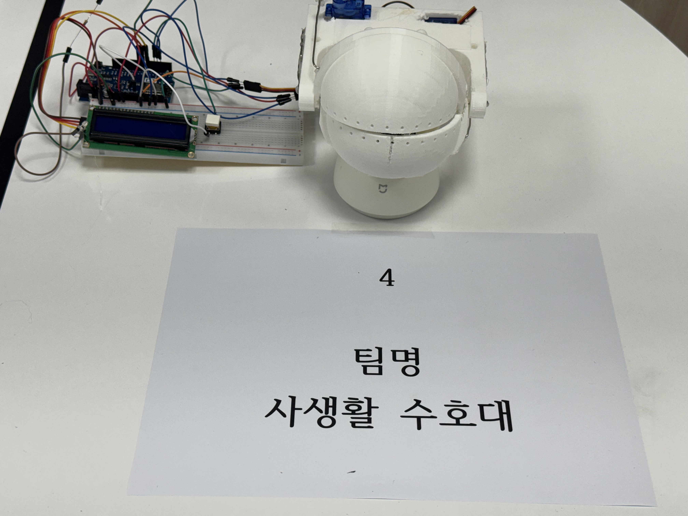
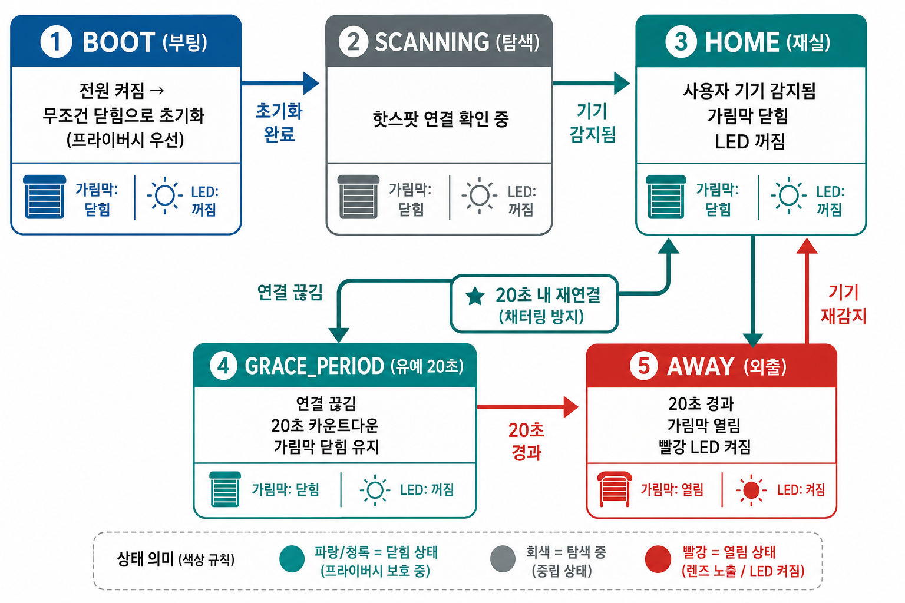

# 막아조 (MAKAJO) — 해킹당해도 열리지 않는 펫캠 가림막

> 기존 펫캠 위에 씌우기만 하면, 집에 사람이 있을 때 카메라 렌즈를 자동으로 가려주는 지능형 물리 가림막입니다.
> 카메라가 해킹당해도 가림막은 열리지 않습니다 — 소프트웨어가 아니라 **물리적 시스템 분리**로 사생활을 지키기 때문입니다.



---

## 작동 영상


Uploading IMG_0217.MOV…


---

## 한눈에 보기

| 항목 | 내용 |
|---|---|
| 무엇 | 펫캠 렌즈를 자동 개폐하는 독립형 물리 가림막 |
| 핵심 가치 | 카메라와 완전히 분리 → 카메라가 뚫려도 가림막은 안 열림 |
| 동작 | 집 와이파이에 사용자 기기가 있으면 닫힘, 없으면 열림 (자동) |
| 제어 | Wemos D1 R2 (ESP8266) + SG90 서보 2개 |
| 부품 원가 | 약 17,750원 (프로토타입 1대 기준) |
| 상태 | 작동하는 프로토타입 완성 |




---

## 왜 만들었나

펫캠 해킹은 대부분 특정인을 노린 정교한 공격이 아니라, 인터넷에 연결된 기기를 무작위로 훑는 **자동 스캐닝**에서 시작됩니다. 펫캠은 외부에서 영상을 보려고 항상 인터넷·클라우드 서버에 연결돼 있어야 하므로, 구조적으로 늘 그 스캐닝의 대상이 됩니다.

시중에도 물리 셔터가 달린 홈캠(Tapo, Arlo 등)이 있지만, 한 가지 근본적 한계가 있습니다. **셔터 모터가 카메라와 같은 시스템 위에서 동작한다는 점**입니다. 해커가 카메라 시스템 권한을 탈취하면, 앱에서 버튼을 누르는 것과 똑같이 셔터를 원격으로 열 수 있습니다. 소프트웨어로 제어되는 물리 차단은 소프트웨어 해킹 앞에서 무력합니다.

막아조는 이 문제를 **소프트웨어 강화가 아니라 구조 설계로** 풉니다.

---

## 어떻게 다른가 — 시스템 분리



```
[기존 일체형 셔터 카메라]              [막아조]

  +------------------+            +------------------+
  |  카메라 두뇌      |            |  펫캠 (그대로)    |
  |  (인터넷 연결)    |            |  (인터넷 연결)    |
  +--------+---------+            +------------------+
           | 같은 시스템                  X  연결 없음
  +--------+---------+            +------------------+
  |  셔터 모터       |            |  막아조 가림막     |
  |  (같은 두뇌가 제어)|            | (로컬 전용·외부망 X)|
  +------------------+            +------------------+

  해킹되면 셔터도 열림             카메라 해킹돼도 가림막은 안 열림
```

설계의 두 원칙:

1. **시스템 완전 분리** — 펫캠과 막아조는 물리적으로도, 네트워크적으로도 연결이 없는 별개 기기입니다. 펫캠을 100% 장악해도 막아조 모터를 제어할 통로가 존재하지 않습니다.
2. **로컬 전용 네트워크** — 막아조는 외부 인터넷으로 나가지 않습니다. 집 안 공유기 내부에서 사용자 기기의 존재 여부만 확인합니다. 해외에서의 원격 접근이 네트워크 구조상 불가능합니다.

---

## 어떻게 작동하나

사용자가 귀가해 스마트폰이 집 와이파이에 잡히면 막아조가 이를 감지해 렌즈를 닫습니다. 외출해 연결이 끊기면 일정 시간 뒤 렌즈를 열어 펫캠이 다시 반려동물을 모니터링합니다.

시스템은 5개 상태로 관리됩니다.

| 상태 | 의미 | 가림막 | LED |
|---|---|---|---|
| `BOOT` | 부팅 — 무조건 닫힘으로 초기화 | 닫힘 | 꺼짐 |
| `SCANNING` | 와이파이 연결 확인 중 | 닫힘 유지 | 꺼짐 |
| `HOME` | 사용자 기기 감지 (재실) | 닫힘 | 꺼짐 |
| `GRACE_PERIOD` | 연결 끊김 — 20초 유예 카운트다운 | 닫힘 유지 | 꺼짐 |
| `AWAY` | 외출 확정 — 렌즈 노출 | 열림 | 켜짐 |

**유예 시간(채터링 방지)**: 잠깐 쓰레기를 버리러 나가거나 와이파이가 순간 끊겼을 때, 가림막이 불필요하게 열렸다 닫혔다 하는 것을 막기 위해 연결이 끊겨도 20초를 기다린 뒤에야 외출로 판단합니다.

**페일세이프(사생활 우선)**: 부팅 직후에도, 오류 상황에서도 기본값은 항상 '닫힘'입니다. 어떤 상황에서도 사생활 보호가 먼저입니다.

**수동 조작**: 네트워크와 무관하게 버튼을 짧게 누르면 개폐를 토글하고, 3초 이상 길게 누르면 재부팅합니다.

---

## 기구 설계

세 가지 구조를 검토한 끝에 마지막 안을 채택했습니다.

| 검토안 | 방식 | 기각/채택 사유 |
|---|---|---|
| 거치대 분리형 수직 회전 | 거치대 위 모터로 가림막 회전 | 펫캠이 회전하면 시야가 노출됨 → 기각 |
| 수직 맞물림 기어 날개형 | 좌우 날개가 기어로 닫힘 | 외팔보 하중·기어 마모, 구조 복잡 → 기각 |
| **애니매트로닉스 안구 메커니즘** | 렌즈부에 직접 붙는 상하 눈꺼풀 | 펫캠이 어느 방향으로 돌아도 함께 움직임 → **채택** |

본체는 PLA로 3D 프린팅했고, 서보 혼과 눈꺼풀은 철사로 연결했습니다.

---

## 하드웨어 구성

| 부품 | 사양 | 수량 |
|---|---|---|
| 제어 보드 | Wemos/LOLIN D1 R2 (ESP8266) | 1 |
| 서보모터 | SG90 마이크로 서보 (180°) | 2 |
| 상태 LED | 5mm 빨강 (+ 100Ω 저항) | 1 |
| 입력 | 택트 푸시 버튼 | 1 |
| 출력물 | PLA 필라멘트 약 180g | — |

> 시연 단계에서는 상태 표시용 I2C LCD를 추가로 사용했으나, 실제 제품 구성에서는 제외했습니다.

### 핀 배치

| 기능 | 핀 |
|---|---|
| 서보 (위/아래) | D1 / D2 |
| 버튼 | D3 |
| 상태 LED (빨강) | D7 |

---

## 저장소 구조

```
.
├── README.md
├── LICENSE
├── poster.png              # 컨셉 포스터
├── state-diagram.png       # 상태 흐름도
├── photo.jpeg              # 실물 사진
└── src/
    └── makajo.ino          # 펌웨어 (Arduino/ESP8266)
```

---

## 빌드 & 업로드

1. Arduino IDE에 ESP8266 보드 패키지를 설치합니다.
2. 보드를 `LOLIN(WEMOS) D1 R2 & mini`로 선택합니다.
3. `src/makajo.ino`를 열고 상단의 와이파이 정보(`ssid`, `password`)를 본인 환경에 맞게 수정합니다.
4. 컴파일 후 업로드합니다.

> 재실 판단은 막아조가 해당 와이파이에 연결되어 있는지 여부로 동작합니다. 시연 환경에서는 스마트폰 핫스팟을 "집 와이파이"로 사용했습니다.

---

## 기술 스택

`C++ (Arduino)` · `ESP8266` · `Wi-Fi` · `Servo` · `3D 프린팅 (PLA)` · `상태 머신 설계`

---

## 한계와 향후 계획

- 현재 프로토타입은 와이파이 재실 감지를 사용합니다. 실제 제품에서는 최초 1회만 블루투스(BLE)로 기기를 등록하고 이후 외부 통신을 완전히 차단하는 방식을 계획하고 있습니다.
- 본체를 더 소형화하고, 다양한 펫캠 렌즈부에 맞는 마운트 옵션을 추가할 수 있습니다.

---

## 라이선스

MIT License — 자세한 내용은 [LICENSE](LICENSE) 참고.
